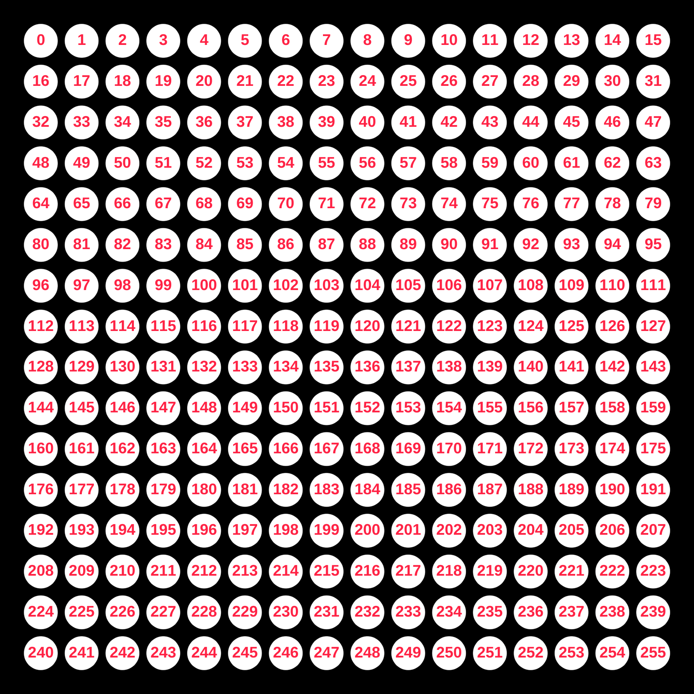

# What is the `i` (or "index")?

The help text on tixy.land says:

> `i` is the index of the dot (0..255)

This means that each dot on the 16x16 grid can be identified by a number:



This allows manipulating an individual dot, based on its `index`.

## Example

The following `tixy` will highlight each dot, one index at a time.

```
i             // the index ( from 0 to 255)
==            // should match
ceil(t) % 255 // the remainder of time (as an integer) divided by 255
  ? -1        // If it does, make it red
  :  1        // Otherwise, make it white
```


<iframe height="350" src="https://tixy.land/?code=i%3D%3Dceil%28t%29%25255%3F-1%3A1"></iframe>
